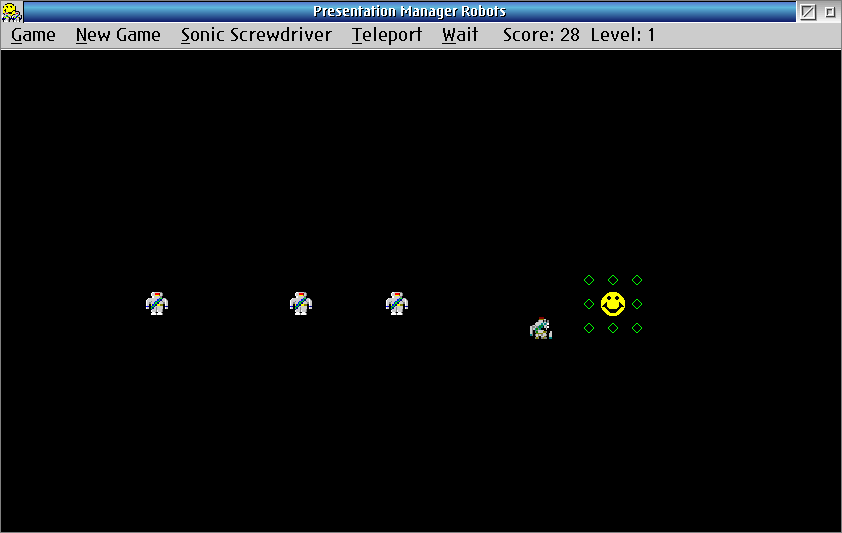

# GAME-PUZZLE-PM_Robots

Version 1.5 — A version of the classic UN*X game "robots" for the OS/2 Presentation Manager.



## Overview

Keep Smiley alive by keeping him away from the Killer Robots. Move Smiley with
the left mouse button; the robots chase him every turn. Make robots crash into
each other or into heaps to score points.

## Controls

- **Left mouse button** — move Smiley toward the pointer
- **Right mouse button** — wait (same as Game > Wait)
- **S** — Sonic Screwdriver
- **T** — Teleport
- **W** — Wait
- **Ctrl+N** — New Game
- **Ctrl+X** — Exit
- **Ctrl+F** — Frame Controls toggle (borderless mode)

## Build Instructions

Requires Open Watcom C/C++ and the OS/2 Toolkit header files.

```
compile-wat.cmd
```

Or directly:

```
wmake -f makefile.wat all
```

Output is placed in `bin\Robots.exe`.

## Project Layout

```
src/        Source files (.c, .h, .rc, .def, .ico)
bin/        Build output (.exe, .obj, .res, .map)
doc/        Documentation (Readme.txt, Changelog.txt, LICENSE.txt)
img/        Game tile bitmaps and cursor pointers
legacy/     Original unmodified source kept for reference
makefile.wat    Open Watcom build file
compile-wat.cmd OS/2 CMD build script
```

## License

GNU GPL V3

## Authors

- Kent Lundberg (original author, 1993-2002)
- Martin Iturbide (2023-2026 — ArcaOS port and standardization)

## Links

- https://www.os2world.com/games/index.php/native-games/puzzle/245-pm-robots
